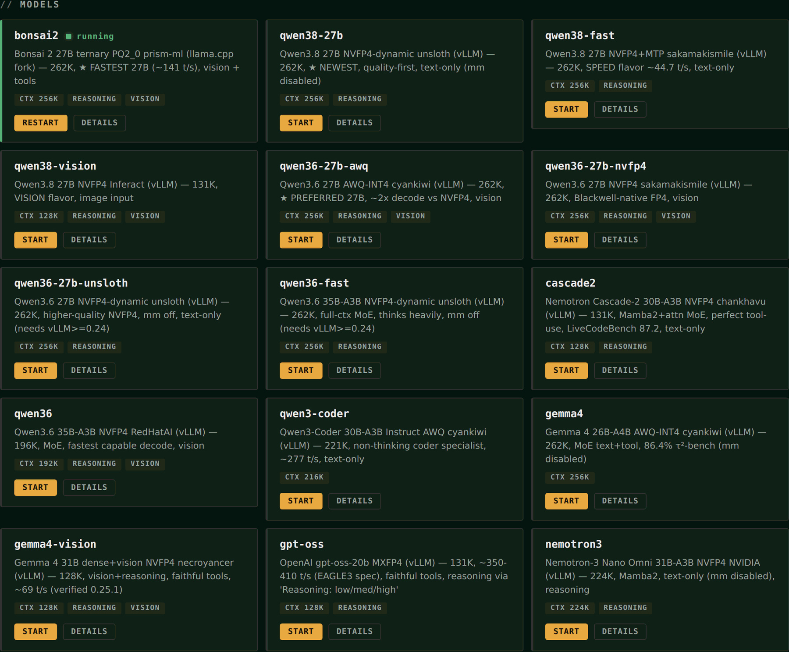
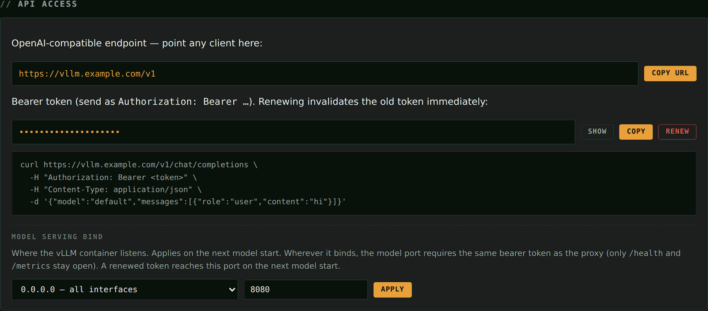
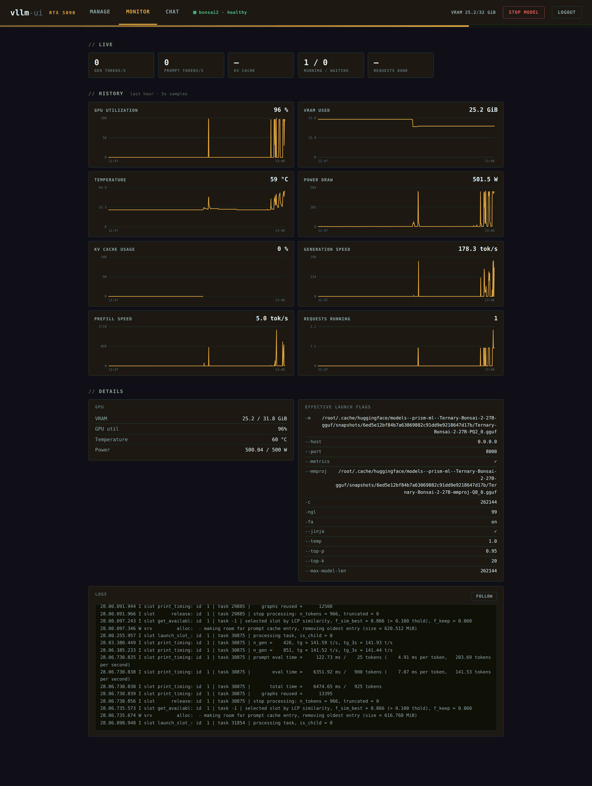
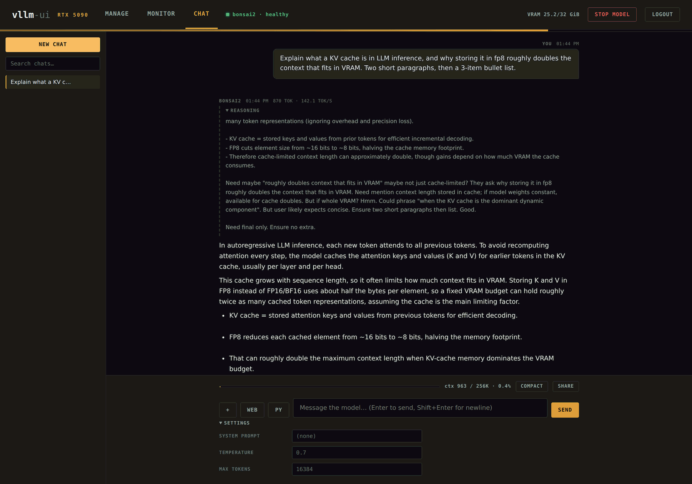
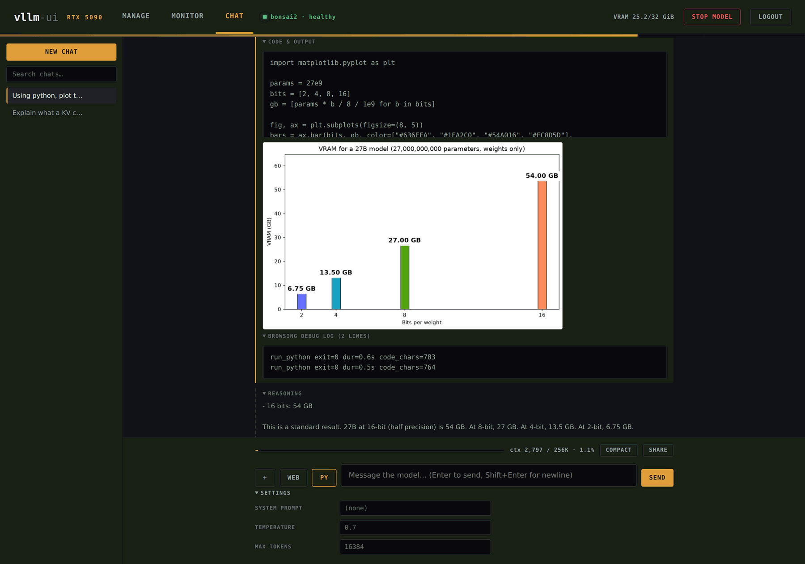
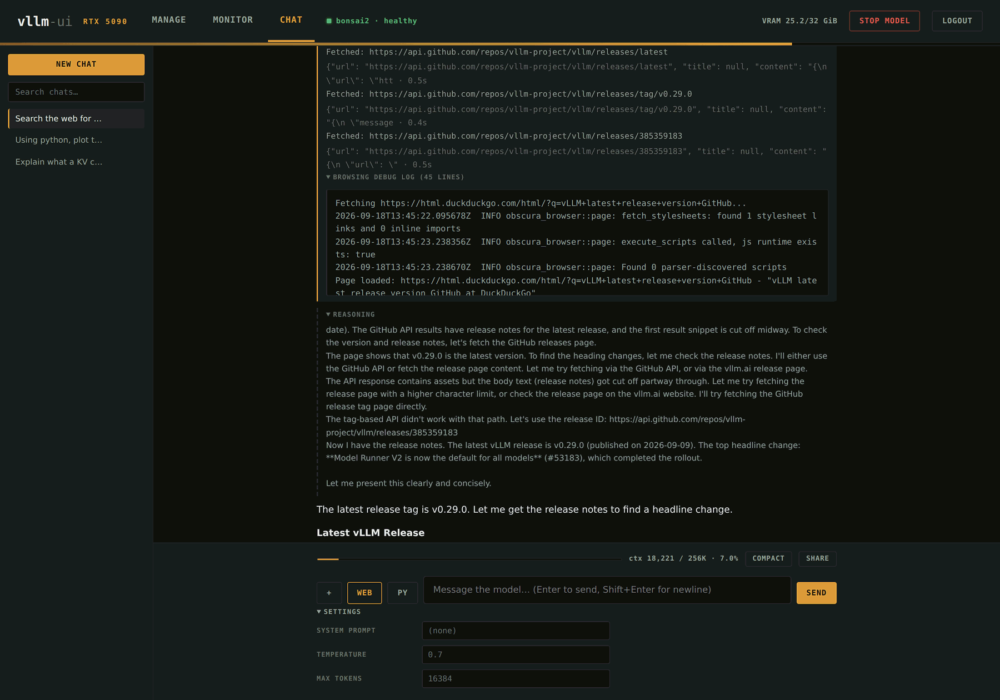
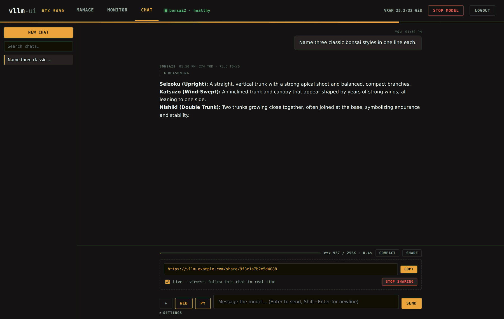

# rtx5090-vllm

**One-click vLLM serving for the RTX 5090 (32 GB, Blackwell sm_120).**

A curated set of large language models that actually fit on a single RTX 5090,
each with a hand-tuned launch config (quant, context length, KV precision,
tool-call parser) verified to boot and serve on a 32 GB card. Pick a model and
go — weights download automatically on first run.

```bash
make                        # host check → web UI → a served model, ready to use
make MODEL=qwen36-27b-awq   # ...with the model you name
```

The server exposes an **OpenAI-compatible HTTP API** at
`http://<host>:8080/v1`, so it drops straight into any OpenAI client, agent
framework, or coding tool.

There is also an optional [web UI](#web-ui): switch models with a click, watch
the GPU while it serves, and talk to the running model in a full chat app with
web browsing, a Python sandbox and file uploads.



---

## Why this exists

The 5090's 32 GB of VRAM and **native NVFP4/MXFP4 tensor cores** put it in an
awkward spot: big enough for serious 27–35B models, but only with the right
quant and context math. Get a flag wrong and you OOM on boot, silently fall
back to a slow kernel, or get garbage tool calls from a mismatched parser.

This repo encodes the working configs so you don't have to rediscover them.
Every model in the lineup has been booted and completion-tested on a real
32 GB 5090.

---

## Requirements

- **RTX 5090** (32 GB). Other 32 GB Blackwell cards likely work; smaller cards
  will OOM on most models — drop `--max-model-len` and bump quant aggressiveness.
- **NVIDIA driver** with CUDA 12.8+ (Blackwell sm_120 support).
- **Docker** with the [NVIDIA Container Toolkit](https://docs.nvidia.com/datacenter/cloud-native/container-toolkit/latest/install-guide.html)
  (`--runtime nvidia --gpus all` must work).
- **`curl`**, **`git`** and **`python3`** — `git` clones the llama.cpp fork for
  `RUNTIME=llamacpp` models, `python3` reads the UI token and validates JSON.
- **`jq`** for the test scripts (`test-chat.sh`, `bench-ctx.sh`).
- **`hf` CLI** (`pip install "huggingface_hub[hf_xet]"`) for fast downloads —
  optional, a Docker-based fallback is built in.
- Disk: ~30 GB free to start (images plus the 7.4 GB default model); ~20 GB per
  additional model, ~315 GB for the whole lineup.

No local Python/PyTorch/CUDA install needed — vLLM runs entirely inside the
`vllm/vllm-openai:latest` container.

`make preflight` checks all of this and tells you exactly what to do about
anything missing. `make` runs it for you before touching anything.

---

## Quickstart

```bash
git clone https://github.com/p4u/rtx5090-vllm.git
cd rtx5090-vllm

cp .env.example .env     # then set UI_PASSWORD=<something real>
make                     # that's it
```

`make` is the whole install. It checks the host first and **stops with an
instruction if anything is missing** (no Docker, no GPU access, no
`UI_PASSWORD`, not enough disk) rather than failing twenty minutes into a
build. Then it starts the web UI, downloads the default model's weights,
builds whatever runtime image that model needs, serves it, waits for the
healthcheck, and prints where everything is:

```
==> Up.

  web UI      : http://localhost:8090/
  OpenAI API  : http://localhost:8090/v1   (bearer token — API access panel in the UI)
  model       : bonsai2
```

The default is [`bonsai2`](#two-runtimes) — the smallest download in the lineup
and the fastest decode. Pick another with `make MODEL=<key>` (`make list` shows
them all). Re-running `make` is cheap and safe: it leaves running pieces alone
and only does what's actually missing.

Everything else is a target too:

```bash
make list                        # model keys + descriptions
make MODEL=gpt-oss               # switch the served model
make status                      # what's running
make logs                        # follow the model's logs
make test-chat PROMPT="Write a haiku about GPUs."
make stop                        # stop the model   (make ui-stop for the UI)
make help                        # every target
```

And the API is plain OpenAI, from anywhere:

```bash
curl http://localhost:8080/v1/chat/completions \
  -H "Content-Type: application/json" \
  -d '{"model":"default","messages":[{"role":"user","content":"hi"}]}'
```

> Every target is a thin wrapper around a script, and the scripts stay the
> source of truth and remain directly runnable: `make run MODEL=gpt-oss` *is*
> `./run.sh gpt-oss`. Only `make`/`make up` adds anything of its own — the
> host checks and the ordering. `make help` lists every target.

> **Binding:** by default the server binds `0.0.0.0:8080` (reachable on your
> LAN). For localhost-only, run `HOST_IP=127.0.0.1 make MODEL=<key>` — make
> passes the environment straight through to the script.
>
> **Restrict to one network:** set `BIND_CIDR=<subnet>` and the published port
> binds only to this host's address on that subnet, so vLLM is reachable only
> from that network — e.g. a WireGuard VPN:
>
> ```bash
> BIND_CIDR=10.200.0.0/24 make MODEL=gpt-oss   # binds to the host's 10.200.0.x addr only
> ```
>
> `HOST_IP` (an explicit address) overrides `BIND_CIDR`. A socket binds a single
> address, not a CIDR, so this restricts the **interface**, not the source IP —
> for an isolated subnet/VPN that is the practical lock. For strict per-source
> filtering, also add a firewall rule, e.g.:
>
> ```bash
> sudo iptables -A INPUT -p tcp --dport 8080 ! -s 10.200.0.0/24 -j DROP
> ```
>
> **Config via `.env`:** `run.sh` auto-sources a `.env` file in the repo root if
> present, so you can persist `HOST_IP` / `HOST_PORT` / `BIND_CIDR` / `HF_TOKEN`
> instead of typing them each run. Copy the template and edit:
>
> ```bash
> cp .env.example .env      # then uncomment what you need
> ```
>
> Real environment variables still override `.env` (e.g. `BIND_CIDR=… make`).
> `.env` is gitignored (it may hold `HF_TOKEN`); `.env.example` is committed.

---

## Web UI

A dockerized management UI + authenticated API gateway. Switch models with a
click, tune launch flags, watch live vLLM metrics/logs/GPU stats, and gate the
OpenAI API behind a bearer token.

`make` already started it. To manage it on its own:

```bash
# .env: set UI_PASSWORD=... (required), optionally UI_HOST / UI_PORT / UI_DOMAIN
make ui                      # build + start the vllm-ui container
make ui-logs                 # follow its logs
make ui-stop                 # stop it
# open http://<host>:8090/  → log in with UI_PASSWORD
```

The API access panel is the first thing shown: the OpenAI endpoint URL, the
bearer token, and a copy-paste curl. Set `UI_DOMAIN` in `.env` (bare hostname,
or a full `https://` origin when behind a TLS proxy) and the UI builds the
displayed URL from it instead of the browser's address.

### A quick tour

**Hand out one endpoint and one token.** The whole API surface is on the first
screen: the URL to paste into any OpenAI client, a bearer token you can show,
copy or renew (renewing kills the old one instantly), and the bind address the
model itself listens on — which is never tokenless, wherever it binds.



**Watch the card while it works.** The Monitor tab samples the GPU and the
engine every 5 seconds and keeps an hour of history — utilization, VRAM,
temperature, power, KV cache, generation and prefill speed, requests in flight
— plus the *effective* launch flags of the live container and a follow-mode log
tail. The screenshot below is a 27B model mid-generation: 96% GPU, 501 W,
178 tok/s.



**Talk to the model that's running.** The Chat tab is a full chat app — streamed
markdown, collapsible reasoning for thinking models, per-reply token counts and
tok/s, and a context meter that tracks how much of the window you've used.



**It can run code.** Turn on `PY` and the model gets a `run_python` tool. Each
call runs in a throwaway sandbox container with no network and a read-only
rootfs; matplotlib figures are captured and rendered inline, while the model
only ever sees stdout and stderr.



**It can read the web.** Turn on `WEB` and the model can search and fetch pages
through [obscura](https://github.com/h4ckf0r0day/obscura), one throwaway
container per fetch. Every query, URL and duration shows inline, with the
browser engine's own trace behind an expandable debug log — so you can see
exactly what it read.



**And you can share the result.** One click publishes a read-only copy at an
unguessable URL. Tick *Live* and viewers follow the conversation as it streams;
revoking kills the link instantly.



### Everything it does

- **Model switching** — every model in the lineup as a card; Start/Stop/switch
  with a confirmation. Boot progress is streamed (download → load → ready),
  and crash-loops from bad overrides are detected and surfaced.
- **Model details** — per-model override form (`--max-model-len`,
  `--gpu-memory-utilization`, `--max-num-seqs`, `--max-num-batched-tokens`,
  `--kv-cache-dtype`, free-form extra args). Overrides are appended after the
  verified per-model flags (last-wins), persisted across restarts, and never
  written back into `run.sh`. A reset button returns to the verified defaults.
- **Monitor tab** — live tiles from vLLM `/metrics` (tokens/s, KV-cache usage,
  running/waiting requests, TTFT, spec-decode acceptance) plus an hour of
  history charts sampled every 5 s server-side (GPU utilization, VRAM,
  temperature, power, KV cache, generation/prefill speed, requests) with
  hover crosshairs; below them the effective launch flags of the live
  container, `nvidia-smi` details, and a follow-mode log panel. (A
  `RUNTIME=llamacpp` model publishes fewer counters than vLLM — no KV-usage
  ratio and no latency histograms — so those tiles read `—`.)
- **API access panel** — a single bearer token for the OpenAI API, with
  show/copy/**renew** (renewing invalidates the old token instantly).
- **Web browsing in chat** — the model can search the web and read pages,
  powered by [obscura](https://github.com/h4ckf0r0day/obscura) (a headless
  browser engine; one throwaway `docker run` per fetch — `run-ui.sh` pulls the
  image). On by default via the `Web` toggle in the composer; tool calls show
  as an inline activity block (queries, URLs, durations) with an expandable
  browsing debug log (obscura's tracing output). Search uses DuckDuckGo's
  HTML endpoint; obscura's private-network/SSRF protection is intentionally
  left on, and fetched content is treated as untrusted data. Requires a model
  with an active `--tool-call-parser` (all lineup models qualify).
- **Python execution in chat** — a `Py` toggle (on by default) gives the
  model a `run_python` tool: each call executes in a throwaway sandbox
  container (`vllm-pysandbox`, built by `run-ui.sh`) with numpy, pandas,
  matplotlib, scipy, sympy, pillow and networkx baked in — **no network,
  read-only rootfs, 1 GB/2-cpu/30 s limits**, run as nobody. Open matplotlib
  figures are captured automatically and rendered inline in the chat
  (ChatGPT-style); the model sees stdout/stderr, the human sees the charts.
  Each run's code and output sit in a collapsible fold.
- **Chat tab** — a ChatGPT-style chat with whatever model is running:
  streamed responses with markdown rendering, collapsible reasoning for
  thinking models, multiple conversations (kept in your browser's
  localStorage), a system-prompt/temperature/max-tokens panel, stoppable
  generation, and file uploads — text files are inlined into the message as
  fenced code blocks; images go as vision input (gated on the running model
  actually having vision); **PDFs** are converted server-side (poppler):
  text-layer extraction for normal PDFs on any model, and page-image
  rendering for scanned PDFs when a vision model is running; **DOCX** text
  is extracted too. Other binary formats are rejected with a clear message. Conversation management: **rename** sessions (pencil or
  double-click), **export to Markdown** (per chat, includes reasoning and
  browsing activity), search across chats, per-message **copy**,
  **regenerate** the last reply, and **edit & resubmit** a user message
  (truncates and regenerates from that point). Each reply is stamped with
  the model that produced it, a timestamp, and measured tokens + tok/s.
  **Share Chat**: a button creates a public read-only link under an
  unguessable URL (`/share/<192-bit token>` — possession of the link is the
  credential; `noindex`, revocable, dies instantly on revoke). With the
  **Live** option, viewers follow the conversation in real time as replies
  stream (the owner's browser pushes updates; viewers poll until the share
  goes static). Debug logs, tool stdout and text-file contents are stripped
  before anything leaves the browser.
  A **context meter** above the composer shows live utilization of the
  model's effective context window (from the stream's `prompt_tokens`), and
  a **Compact** button replaces the conversation with a model-written
  summary that stays in context (viewable in a fold, included in exports) —
  freeing the window while preserving continuity.

**Security model.** The UI is password-gated (`UI_PASSWORD`). The UI also
serves the OpenAI API at `http://<host>:8090/v1` as a reverse proxy that
requires `Authorization: Bearer <token>`. Where the *model itself* listens is
configurable from the API access panel ("Model serving bind"): by default it
follows `.env` (`HOST_IP` / `BIND_CIDR` / `HOST_PORT`), with presets for
`127.0.0.1` (loopback), each of the host's configured network addresses, or
`0.0.0.0`. **The model port is never open tokenless**: UI launches pass the
bearer token to vLLM itself (`VLLM_API_KEY`), so the direct port demands the
same token as the proxy wherever it binds (only `/health` and `/metrics` stay
unauthenticated, for the healthcheck and monitoring). A renewed token reaches
the direct port on the next model start; the proxy always works because it
authenticates upstream with the key the live container was launched with.
`make` does the same thing: it reads the UI's token and passes it to the
model it starts. Set `VLLM_API_KEY` in `.env` to gate bare `make run` launches
too:

```bash
curl http://<host>:8090/v1/chat/completions \
  -H "Authorization: Bearer <token from the UI>" \
  -H "Content-Type: application/json" \
  -d '{"model":"default","messages":[{"role":"user","content":"hi"}]}'
```

A bare `make run` from a shell keeps its own binding behavior (`HOST_IP` /
`BIND_CIDR`) — the UI detects and manages externally-launched containers too,
whatever address they bound. `pi.models.json` ships pointed at the proxy
(`:8090/v1`) — paste your token into its `apiKey`.

**TLS.** Set `UI_TLS=1` (with `UI_DOMAIN`, optional `TLS_EMAIL`) in `.env`
and `run-ui.sh` obtains a real Let's Encrypt certificate via acme.sh
**TLS-ALPN-01** and serves the UI + OpenAI proxy at `https://<domain>/` —
**always on port 443** (`UI_PORT` is ignored; TLS on other ports is not
supported). Plain http hitting 443 or 80 redirects to https. Renewal is
fully automatic: a daily task launches a detached helper that briefly stops
the UI to free :443, renews, and restarts it (~30 s every ~60 days). The
only requirement: **public inbound port 443** must reach the host (open
`443/tcp` — and optionally `80/tcp` — in your firewall). Without TLS,
password and token travel in plaintext — keep the UI behind a VPN.

How it runs: the `vllm-ui` container mounts the docker socket and the repo (at
its identical host path) and drives `./run.sh` — the hand-tuned launch configs
stay the single source of truth. `make ui-stop` / `make ui-logs` manage it; the
UI's own state (token, overrides) lives in `ui/data/` (gitignored).

---

## Model lineup

Fifteen models, each filling a specific role. `make list` prints the keys,
`make run` with no `MODEL` gives an interactive picker, and `./run.sh --help`
dumps the full per-model rationale (the VRAM math and OOM boundaries).

All but one run on the vLLM image. `bonsai2` is the exception — it needs a second
runtime (see [Two runtimes](#two-runtimes) below).

| key                | params        | quant      | ctx (5090) | vision | role |
|--------------------|---------------|------------|------------|--------|------|
| `bonsai2`          | 27B dense+vis | ternary PQ2_0 | 262K    | ✓      | ⭐ **Fastest**: ~141 t/s decode, 6.8 GB weights — runs on the llama.cpp fork, **not vLLM** |
| `qwen38-27b`       | 27B dense     | NVFP4-dyn  | 262K       | —      | ⭐ Qwen3.8 **quality** flavor: dynamic quant, mm off (needs vLLM ≥0.28) |
| `qwen38-fast`      | 27B dense     | NVFP4+MTP  | 262K       | —      | Qwen3.8 **speed** flavor: MTP spec decode ~44.7 t/s (1.6×), mm off (≥0.28) |
| `qwen38-vision`    | 27B dense+vis | NVFP4      | 131K       | ✓      | Qwen3.8 **vision** flavor: image input, ctx pays for the encoder (≥0.28) |
| `qwen36-27b-awq`   | 27B dense     | AWQ INT4   | 262K       | —      | ⭐ Best coding quality/token, ~2× decode vs NVFP4 |
| `qwen36-27b-nvfp4` | 27B dense     | NVFP4      | 262K       | —      | Same model, Blackwell-native FP4 path |
| `qwen36-27b-unsloth`| 27B dense    | NVFP4-dyn  | 262K       | —      | unsloth dynamic NVFP4, higher-q/slower, mm off (needs vLLM ≥0.24) |
| `cascade2`         | 30B/3B MoE    | NVFP4      | 131K       | —      | ⭐ Mamba2+attn, perfect tool-use, LiveCodeBench 87.2 |
| `qwen36`           | 35B/3B MoE    | NVFP4      | 196K       | ✓      | Newest Qwen flagship, fastest capable decode |
| `qwen36-fast`      | 35B/3B MoE    | NVFP4-dyn  | 262K       | —      | unsloth 35B-A3B, full ctx, thinks heavily, mm off (needs vLLM ≥0.24) |
| `qwen3-coder`      | 30B/3B MoE    | AWQ INT4   | 221K       | —      | Non-thinking coder specialist, ~277 t/s |
| `gemma4`           | 26B/4B MoE    | AWQ INT4   | 262K       | —      | Google text+tool, 86.4% τ²-bench (mm disabled) |
| `gemma4-vision`    | 31B dense+vis | NVFP4      | 128K       | ✓      | Vision+reasoning Gemma 4, 0.24+-compatible (unquantized lm_head), ~69 t/s |
| `gpt-oss`          | 21B/3.6B MoE  | MXFP4      | 131K       | —      | OpenAI open weights, `Reasoning: low/med/high` |
| `nemotron3`        | 31B/3B MoE    | NVFP4      | 224K       | —      | NVIDIA Omni reasoning MoE (mm disabled) |

`ctx` = verified boot + completion ceiling on a single 32 GB card with fp8 KV.
The container tracks `vllm/vllm-openai:latest` (currently **0.28.0**). Most
values were first confirmed on 0.22.1; the two `unsloth` NVFP4-dynamic entries
require vLLM ≥ 0.24. The old LilaRest text-only Gemma 4 was **removed** — its
quantized `lm_head` breaks on vLLM ≥ 0.24; `gemma4-vision` (unquantized head)
replaces it and is verified on 0.25.1.

### Two runtimes

Every model above runs on `vllm/vllm-openai:latest` except `bonsai2`, which
**cannot** run on vLLM at any version — and that is a property of the weights,
not a missing feature:

- 402 of its 851 tensors use **ggml type id 142**, which exists only in
  prism-ml's llama.cpp fork (upstream ggml defines ids 0–41).
- The checkpoint carries `prism.hadamard.*` metadata for a Walsh-Hadamard
  transform applied to activations at runtime, plus an inverse transform on the
  embedding lookup. It is a modified forward pass, not just a quantization.
- A loader that ignores that metadata returns **fluent-looking garbage rather
  than an error**, so "just try it on the stock engine" is never safe here.

So `run.sh` carries a `RUNTIME` field per model. `RUNTIME=llamacpp` launches the
fork's `llama-server` instead of vLLM, and everything around it is unchanged: same
container name and port, same `vllm.model-key` label, the same alias list (via
`--alias`), the same bearer token (via `LLAMA_API_KEY`), and `/health` +
`/metrics` for the healthcheck and watchdog. Build the image once:

```bash
make build-llamacpp
```

It detects your GPU's compute capability, clones the fork's `prism` branch and
compiles CUDA kernels for that one architecture (~20 min). `run.sh` also builds
it automatically the first time you launch a `RUNTIME=llamacpp` model. The
weights are two files, not the whole repo (`F16` there is 53.8 GB):

```bash
make download REPO=prism-ml/Ternary-Bonsai-2-27B-gguf GLOB="*PQ2_0.gguf"
make download REPO=prism-ml/Ternary-Bonsai-2-27B-gguf GLOB="*mmproj-Q8_0.gguf"
```

`make` does both for you — it fetches only the files the entry actually uses,
never the whole repo.

**The trade, measured on the 5090** (batch 1, streaming, TTFT excluded). Decode
is far faster but decays with depth, where the vLLM dense entries stay flat;
prefill is roughly half of vLLM's, so very deep prompts cost real wall-clock (a
250K prefill is ~3.5 min):

| context | bonsai2 decode | bonsai2 prefill | `qwen38-27b` decode |
|---------|----------------|-----------------|---------------------|
| short   | **142 t/s**    | —               | 28.5 t/s |
| 8K      | 134 t/s        | 3,765 t/s       | 28.5 t/s |
| 40K     | 115 t/s        | 3,287 t/s       | 28.5 t/s |
| 131K    | 81 t/s         | 1,896 t/s       | 28.5 t/s |
| 250K    | 58.8 t/s       | 1,202 t/s       | 28.5 t/s (~2,100 prefill) |

At `-c 262144` with the vision projector resident it uses **25.4 GB of 32.6 GB**,
and a needle test recalled two codes planted at 25%/75% depth of a 249,736-token
prompt. Tool calling (`--jinja`), vision, and the Qwen thinking toggle
(`chat_template_kwargs.enable_thinking`) are all verified working.

### Picking one at a glance

- **Fastest decode, with vision** → `bonsai2` (~141 t/s ternary 27B on llama.cpp; prefill is the trade)
- **Best overall quality (newest Qwen)** → `qwen38-27b` (Qwen3.8 dense, dynamic NVFP4, ~28.5 t/s decode, prefill 6.3K→2.1K t/s from 38K→259K ctx)
- **Newest Qwen, faster** → `qwen38-fast` (same model, MTP speculative decode ~44.7 t/s, standard quant)
- **Newest Qwen with vision** → `qwen38-vision` (image input, 131K)
- **Best coding quality per token** → `qwen36-27b-awq` (dense, 2× decode)
- **Fastest capable daily driver + vision** → `qwen36` (3B-active MoE)
- **Tool-loop with predictable latency** → `qwen3-coder` (no thinking blocks)
- **Strong reasoning + perfect tool-use** → `cascade2`
- **Google Gemma 4 text+tool** → `gemma4`
- **OpenAI weights with a reasoning dial** → `gpt-oss`

---

## How it works

- vLLM runs in the `vllm/vllm-openai:latest` Docker container, one model at a
  time, bound to `:8080`.
- Weights live in `./cache/` using HuggingFace's
  `models--<user>--<repo>/snapshots/<rev>/` layout and are bind-mounted into
  the container (no network at serve time).
- `--served-model-name` registers a long list of **aliases** (`default`, every
  model key, plus generic placeholders like `gpt-4`, `llama`, `model`). Any of
  those route to whatever model is currently loaded, so clients that hardcode a
  model ID work without reconfiguration.
- Per-model launch flags live in `select_model()` in `run.sh`. They are
  measured fits for 32 GB — read the inline comments before changing them.

`make help` lists every target; each one wraps a script, and the scripts below
stay directly runnable if you prefer them:

```
Makefile                # make — brings the whole stack up; make help lists targets
up.sh                   # make up   — preflight → UI → model → wait → report
preflight.sh            # make preflight — host checks, halts with instructions
run.sh                  # main launcher: ./run.sh (picker) | ./run.sh <model> [args]
download-model.sh       # ./download-model.sh <user/repo> [glob] | --all
build-llamacpp.sh       # build the llama.cpp fork image (RUNTIME=llamacpp models)
stop-vllm.sh            # docker rm -f vllm
update-vllm.sh          # docker pull vllm/vllm-openai:latest
logs-vllm.sh            # docker logs -f --tail 200 vllm
watchdog-vllm.sh        # restart the container if it hangs (schedule via cron/systemd)
test-chat.sh            # one-shot chat completion against the server
test-all-models.sh      # boot every model, health-check, completion, summarize
bench-ctx.sh            # context-ceiling sweep across the lineup
run-ui.sh               # web UI + token-gated API proxy (see "Web UI" above)
stop-ui.sh, logs-ui.sh  # manage the vllm-ui container
ui/                     # the UI app (FastAPI + vanilla JS, runs in Docker)
templates/              # chat templates mounted into the container (Gemma 4)
cache/                  # downloaded weights (gitignored)
```

### Resilience — keeping the served model up

The container is launched to survive failure, not just to start:

- **Restart on crash / reboot.** The container runs with `--restart unless-stopped`
  (override with `RESTART_POLICY=...`). If vLLM exits — OOM, CUDA error, assert —
  or the host reboots, Docker brings it back automatically (with exponential
  backoff, so a genuinely broken config won't hammer the GPU). It stays down only
  when you `make stop` it. *Verified:* killing the engine process restarts the
  container and it recovers to `healthy` on its own.
- **Healthcheck.** Docker probes `/health` (`docker ps` shows `healthy`/`unhealthy`).
  A long `--health-start-period` (5 min) avoids false alarms during slow model
  loads + autotune warmup.
- **Hang recovery.** Docker's restart policy only fires when the process *exits* —
  a deadlocked-but-alive server never does. `watchdog-vllm.sh` closes that gap
  — including **livelocks** where `/health` keeps answering while a wedged
  request burns the GPU at ~zero tokens/s (it snapshots the `/metrics` token
  counters and restarts when they freeze with requests running):
  it restarts the container once it's been `unhealthy` for a couple of checks.
  Schedule it (one-shot, don't loop):

  ```bash
  # cron — every minute
  * * * * * /home/you/rtx5090-vllm/watchdog-vllm.sh >> /home/you/rtx5090-vllm/logs/watchdog.log 2>&1
  ```

  or a `systemd` `Type=oneshot` service driven by a `OnUnitActiveSec=60s` timer.

### Common overrides

```bash
# Push context above the per-model default:
make run MODEL=qwen3-coder ARGS="--max-model-len 262144"

# Free more VRAM for KV:
make run MODEL=qwen36 ARGS="--gpu-memory-utilization 0.97"

# Different bind address / port:
HOST_IP=127.0.0.1 HOST_PORT=9090 make run MODEL=gemma4

# Any extra vllm serve args are forwarded verbatim:
make run MODEL=qwen3-coder ARGS="--max-num-seqs 64"
```

`make run` starts the model alone; `make up` (the default) is the one that also
brings up the UI and waits for health. A `RUNTIME=llamacpp` model takes
llama-server flags instead, and `run.sh` translates the vLLM spellings above —
see [Two runtimes](#two-runtimes).

Arg precedence is last-wins: shared defaults → per-model flags → your CLI args.

### Download ahead of time

```bash
make download-all                                        # every model in the lineup
make download REPO=cyankiwi/Qwen3.6-27B-AWQ-INT4         # a specific repo
make download REPO=user/repo GLOB="*.gguf"               # just the matching files
```

Export `HF_TOKEN=hf_...` to avoid unauthenticated HuggingFace rate limits.

---

## Notes on the RTX 5090 (Blackwell)

The 32 GB of VRAM is the binding constraint: weights + KV cache + activations +
CUDA-graph buffers must all fit. After a ~20 GB weight load you have ~10 GB for
everything else.

**Quant format ranking for throughput × quality on sm_120:**

1. **NVFP4** — native FP4 tensor-core path, no dequant, best precision at 4-bit.
2. **MXFP4** — same FP4 path, slightly different scale layout (gpt-oss MoE).
3. **AWQ INT4** — mature, dequants to FP16/BF16; a step slower than NVFP4 but
   often the most *robust* and, in practice, faster to decode on some kernels.
4. **GPTQ INT4** — similar to AWQ, marginally slower.
5. **FP8** — usually too big for 32 GB above ~13B params.
6. **GGUF** — *not supported by vLLM*; use [llama.cpp](https://github.com/ggml-org/llama.cpp).

### Context-maximization ladder

Want max context without OOM? Apply in order:

1. Read the model's `config.json` → `max_position_embeddings` is the hard
   native ceiling (above it vLLM errors, it doesn't OOM).
2. Try native ctx + `--kv-cache-dtype fp8`. Check the boot log for
   `Available KV cache memory: N GiB`.
3. OOM by ≤1 GB → bump `--gpu-memory-utilization` from 0.92 toward 0.97
   (~300 MB per 0.01 step; don't exceed 0.97, the allocator needs headroom).
4. OOM by 1–3 GB → add `--enforce-eager` (frees ~2.5 GB of CUDA-graph memory;
   costs ~6% decode and hurts TTFT on big prefills). Optionally lower
   `--max-num-seqs`.
5. OOM by more → drop `--max-model-len` to the value vLLM prints in the error.

### Tool-call parser cheat sheet

A mismatched `--tool-call-parser` is the most common "it kind of works but tool
calls are broken" failure. The call leaks into `content` as raw text instead of
populating `tool_calls`. Common parsers:

| parser        | emitted format                                          | used by |
|---------------|---------------------------------------------------------|---------|
| `qwen3_coder` | `<tool_call>...<function=...>...</tool_call>` XML        | Qwen3-Coder, Qwen3.6 MoE, Nemotron |
| `qwen3_xml`   | Qwen3 XML variant                                       | Qwen3.6 27B dense |
| `gemma4`      | `<\|tool_call>call:NAME{args}<tool_call\|>`             | Gemma 4 family |
| `openai`      | OpenAI JSON / function_call                             | gpt-oss, OpenAI clones |

`--reasoning-parser` is separate; it splits `<think>` blocks into the response's
`reasoning` field (`qwen3`, `nemotron_v3`, `openai_gptoss`, …).

> vLLM ≥0.22.1 renamed the response field `reasoning_content` → `reasoning`.
> Clients reading the chain-of-thought should handle both.

---

## Gotchas

- **One container, one port.** Only one model serves at a time on `:8080`.
  `run.sh` stops any previous container before starting. Switching models means
  `make MODEL=<other>` (30–120s reload).
- **Root-owned cache after first run.** The container runs as root internally,
  so `cache/` and `logs/` end up root-owned, which breaks user-mode
  `hf download`. Fix once: `sudo chown -R "$USER:$USER" cache logs`.
- **DeltaNet hybrids need prefix caching off.** The Qwen3.6 family carries a
  recurrent state not reflected in KV blocks; prefix caching produces wrong
  outputs. Already handled per-model (`--no-enable-prefix-caching` +
  `--max-num-batched-tokens 4096`).
- **compressed-tensors vs awq_marlin.** Some AWQ quants ship as
  `compressed-tensors`. If vLLM complains the quantization method doesn't match,
  drop `--quantization` and let it auto-detect.
- **Mount the whole cache tree.** HF snapshots symlink into `blobs/`; bind-mount
  the entire `cache/` dir, not just one snapshot, or the symlinks break inside
  the container. `run.sh` already does this.

---

## Adding a model

1. Confirm on-disk weight size leaves room for KV (≤ ~20 GB is comfortable on
   32 GB; > 26 GB will OOM at any useful context).
2. Prefer NVFP4 → MXFP4 → AWQ on Blackwell. Avoid GGUF (use llama.cpp).
3. Verify the chat template matches a vLLM-registered tool-call parser **before**
   committing to a download.
4. Add a `case <key>)` block in `select_model()` (`run.sh`) with the launch
   flags and a comment explaining the VRAM/context math.
5. Add the key + description to the `MODELS` array and `SERVED_ALIASES`.
6. Add the repo to `DEFAULT_REPOS` in `download-model.sh`.
7. Verify with `make test-all MODEL=<key>`.
